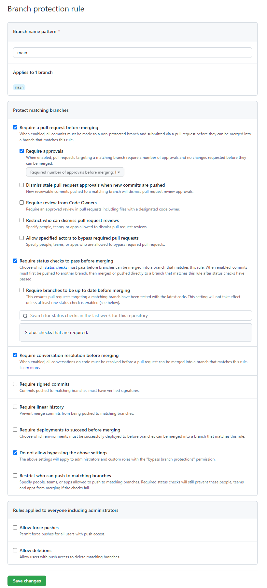

# Plotly dashboard template
A template repository for creating data dashboards with Plotly.

**This is a template, and should not be overwritten.** There are instructions below on how to set up your own development repository.

## Getting started

### Creating a copy of the template

1. Choose a name for the repository to house your code. Please note this name should conform to [snake case (e.g. example_data_dashboard)](https://betterprogramming.pub/string-case-styles-camel-pascal-snake-and-kebab-case-981407998841) to avoid annoying errors later!
1. Create a new repository to house your dashboard from this template, instructions can be found [here](https://docs.github.com/en/repositories/creating-and-managing-repositories/creating-a-repository-from-a-template). **Do not overwrite this template repository.** 

### Configuring GitHub policies
By default, GitHub  does not apply any branch protection policies to newly created repositories. We use these policies to enforce things like: Requiring pull requests to commit changes into the main branch, requiring any comments on pull requests to be resolved and requiring status checks to pass before pull requests can be merged.

1. Open the Settings menu for your GitHub repository ***(Your user needs to be assigned the Admin role to see this option. If it's missing contact your GitHub owner for permission)***

    

1. Click the Add branch protection rule button
    
    

1. Set the options in the below screenshot
    
    


### Installation
1. Follow the [Getting Started instructions](https://github.com/communitiesuk/plotly_dashboard_docs/blob/main/README.md) to the end of Running the application


## Customisation 

### Adding figure to dashboard
1.  Create figure function for specific chart type and save in figure folder on dashboard file
1.  Set a variable equal to the figure function and pass in the necessary parameters
1.  In order to return a graph, set a new variable and pass in dcc.Graph(with the id of your new figure)
```
barchart = bar_chart(df, "Category", "Value", color="Category")
barchart_dash = dcc.Graph(id="example bar chart", responsive=True, figure=barchart)
dashboard_content = [card(barchart_dash)]
```

## Deploying to Gov PaaS
1. Log in to Gov UK PaaS through Cloud Foundry, enter the email address and password registered with Gov PaaS
```bash
cf login
```
2. Create an organisation and space within Gov PaaS. Add users to the space within Gov PaaS with correct permissions [Managing organisation and spaces](https://docs.cloud.service.gov.uk/orgs_spaces_users.html#managing-organisations-spaces-and-users)

Create a space using:
```bash
cf create-space SPACE -o ORGNAME
```
where SPACE is the name of the space, and ORGNAME is the name of the org

3. Once the space has been created, you will need to target that space using:
```bash
cf target -s <SPACE NAME>
```
4. Push the application to the space using:
```bash
cf push <APP_NAME> --no-route
```
5. Create a route for your application using:
```bash
cf create-route <DOMAIN> --hostname <HOSTNAME>
```
6. Once you have created your route, the route will need to be mapped to your application using:
```bash
cf map-route <APP_NAME> <DOMAIN> --hostname <HOSTNAME>
```
7. Update required fields in `.github/workflows/deployment.yml` indicated by &lt;&gt; and a comment. 
8. Set up dedicated accounts - do not use your normal GOV.UK PaaS credentials whilst deploying with GitHub actions.
    Find out more about [configuring your CI tool accounts](https://docs.cloud.service.gov.uk/using_ci.html#configure-your-ci-tool-accounts) in GOV.UK PaaS.
9. [Store the newly created credentials in GitHub Actions][store_creds] - You should store your sensitive credentials in GitHub Actions. 
    Store the username with secret name `GOV_PAAS_USER` and the password with secret name `GOV_PAAS_PASS`.

## OPTIONAL: Create a shared username/password for accessing the hosted dashboard
This can be useful if you want to prevent curious individuals from accessing your dashboard while in development, but does not give any security against malicious actors.
You will need to have access to the `cf` command installed and configured, which can be requested through DAP support.

GOV.UK PaaS provide guidance on how to do this under the title [Example: Route service to add username and password authentication][basic_auth], however following this method you cannot have both basic authentication and IP restricitons in place as your app can only have one routing service. If you would like your app to have basic authentication and IP restricitons, please follow the below steps to add basic authentication using flask:

1. In `bootstrap.py` uncomment the `enable_basic_auth` function
1. In your GitHub repository, add environment secrets for `APP_USERNAME` and `APP_PASSWORD`
1. In `deployment.yml` under the `deploy-staging` job, for the task `Set environment variables` add the below to the run command:
```python 
cf set-env ${{ env.application-name }} APP_USERNAME ${{ secrets.APP_USERNAME }}
cf set-env ${{ env.application-name }} APP_PASSWORD ${{ secrets.APP_PASSWORD }}
```

**Note:** to update basic authentication credentials, update the `APP_USERNAME` and `APP_PASSWORD` secrets in GitHub and re-deploy your app.

More information on secrets can be found [here](https://docs.github.com/en/actions/security-guides/encrypted-secrets)

[store_creds]: https://docs.github.com/en/actions/security-guides/encrypted-secrets#creating-encrypted-secrets-for-a-repository
[basic_auth]: https://docs.cloud.service.gov.uk/deploying_services/route_services/#example-route-service-to-add-username-and-password-authentication

